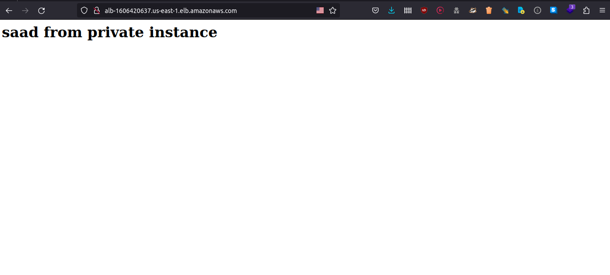

# Terraform Project

This project is a Terraform configuration for creating and managing infrastructure on AWS.

## Requirements
- Terraform 0.14 or later
- AWS account

## Usage
1. Clone the repository
```
git clone https://github.com/ahmedsaadx/terraform-project.git
```
2. Initialize Terraform
```
terraform init
```
3. Plan and apply the Terraform code
```
terraform plan
terraform apply
```
## Note
 - This project is just an example, please use it at your own risk.
 - Before applying the terraform code please make sure you understand what it does.
## results

